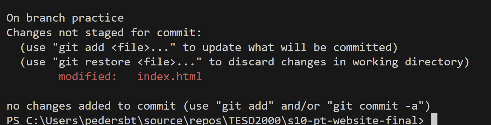

README's are Markdown files, ending with the .md extension. Markdown is a convenient syntax to generage formatted text. It's easy to pick up.

To view markdown, use https://markdown-it.github.io   

# Repository Name:  s10_pt_website_final   
This repository is for students to demonstrate their Git and GitHub skills.       

## Project Descripton: 
This project is to practice Git commands and working with GitHub>     
             
## Practice working in detached HEAD mode:
Secret phrase:  "I traveled back in time to find this" 

# Sample Markdown Document 

## Features Demonstrated 

This doc includes *italic*, **bold** and `inline code`.

You can find more information at [Markdown Guide](https://www.markdownguide.org).

---
